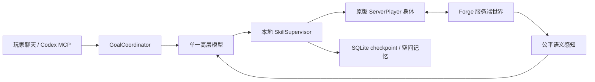

# Architecture

## Authority



模型只能产生版本化的高层 `DecisionEnvelope`。模型不能发 Java、数据包、命令、传送或直接方块修改。移动、碰撞、盾牌、进食、危险停止和其他实时动作由本地 20 TPS 层负责。

## 为什么身体不是 ServerPlayer 子类

26.x 的原版加载和重生路径会直接构造新的 `ServerPlayer`。如果把 AI 身份绑在子类上，正常重生后子类语义会丢失。

本项目因此让原版 `ServerPlayer` 保持唯一身体，以稳定 UUID 外挂 `AiPlayerSession` 控制器。登录使用 Forge 官方测试路径同类的 `PrepareSpawnTask + Connection + EmbeddedChannel`；重生后控制器重新解析同 UUID 的原版替代对象。

## 公平边界

允许：

- AI 身体自身坐标、生命、背包与状态；
- 已加载且经过距离、视锥与遮挡过滤的观察；
- 正常打开后看到的容器内容；
- 明确共享的玩家/Xaero/MCP 标点；
- 已经实际穿越并核验的传送门边。

禁止：

- seed、结构定位 API、隐藏矿物扫描；
- 未打开容器内容；
- 小地图洞穴图、实体雷达或观察者相机；
- 直接传送、直接设置方块、生成物品；
- 伪造真人签名聊天。

## Persistence

主世界 `CompanionWorldData` 保存稳定 UUID、名称、配色、0.0–1.0
模型采样温度、
有界系统偏好、新手引导状态、已见玩家名称、完整活动目标/goal
revision、极限死亡、永久评测写锁、外部导航污染标记与 schema 版本。
展示字段使用一个扁平 `AgentPresentationState` map codec，保持旧
`display_name` 字段兼容且不突破 DataFixerUpper 单组16字段上限。
大量事件、checkpoint 和标点保存在：

```text
<world>/data/mcai_companion/memory.db
```

SQLite 使用有界队列单 writer、WAL、参数化 SQL、FTS5 与 R*Tree。所有 JDBC 工作在专用虚拟线程，不阻塞服务器 tick；队列饱和时 fail-fast 并进入审计计数。

当前运行时仍按原计划首发边界拥有一个活动 Agent。多 Agent 不能只
复制设置行；后续目录必须以 Agent UUID 分片身体生命周期、玩家存档、
目标 revision、模型凭据/网关、SQLite 记忆、技能监督器、皮肤和性能
预算，完成前界面不会宣称多个 Agent 已可同时游玩。

## Revisions

每个模型响应同时绑定：

- request ID；
- decision/observation epoch；
- goal revision；
- 当前可用 skill schema。

身体所在维度、方块位置、生命与关键危险状态变化会推进 decision epoch；活动技能期间只允许其绑定的 epoch。任一版本变化都会使旧响应失效。MCP `observe` 分别返回 goal revision 与 decision epoch；写响应未知时，客户端必须先回读，不能盲目重放。
