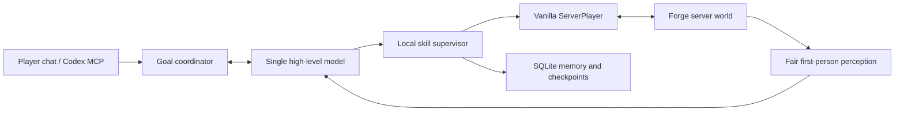

# Architecture

## Authority boundary

`AiServerPlayer` is a `ServerPlayer` with a stable local profile and UUID. It
uses the normal `PlayerList` login/removal path and an embedded connection pump
that consumes keepalive, teleport-confirmation, and outbound packets. The body
is the only authority for position, inventory, hands, armor, hunger, effects,
statistics, death, respawn, and dimension state.

Mining, placing, using, attacking, equipping, crafting, and menus go through
the vanilla player game mode and menu slot transactions. No model or skill may
write a block, item stack, container NBT, or teleport result directly.

## Planning and skills

The model returns a versioned `DecisionEnvelope` containing a request id,
observed world revision, goal revision, decision, optional skill name and typed
arguments, requested observation, optional speech, and confidence. A stale,
malformed, unauthorized, or impossible envelope is discarded.

`SkillSupervisor` owns one active skill and its checkpoint. A skill defines
preconditions, `start`, per-tick behavior, checkpoint, cancel, and result. The
supervisor rechecks the current first-person observation, permission, reach,
line of sight, collision, cooldown, durability, and menu state before every
low-level action. Success requires an observed server-side result.

The model gateway is Java 25 `HttpClient` based. It supports Responses and
OpenAI-compatible Chat Completions, structured-output fallback, one request at
a time, a five-second connection timeout, a configurable soft deadline, and a
hard deadline. It does not retry a request after 401, 429, or a provider 5xx in
a way that can duplicate charges. Secrets are supplied for one request and
redacted from all audit records.

## Local real-time lane

At 20 TPS, the local layer handles movement, collision, jump/step, doors,
food, shield, fall and water clutch, projectile evasion, emergency retreat,
and bounded combat reacquisition. Model latency cannot freeze the body in a
known danger. If the gateway is unavailable, the current atomic operation is
finished when safe, then the companion guards, eats, retreats, or returns to a
known safe area.

## Fair perception

The perception sampler uses only the companion's eye position, look direction,
loaded chunks, distance/FOV, and ordinary visual/collider ray clips. Entity and
block observations carry provenance, sample sequence, observation age, and
world/goal revision. Multipart entities, including the Ender Dragon, publish a
stable parent id but retain a collider point that passed the same first-person
line-of-sight checks used by the action layer.

Semantic text is sampled at 2–5 Hz and body/danger state at 20 Hz. Screenshots
are task-triggered for unfamiliar GUIs, visual questions, or aesthetic work;
they are HUD-cleaned and never a continuous observer video. A third-person
camera is not an input to the model.

## Memory and navigation

SQLite uses WAL, FTS5, and R*Tree. Records cover immediate scenes, a rolling
navigation graph, regional corridors, semantic topology, assets, waypoints,
verified portal edges, and task checkpoints. Every record stores source,
dimension, revision, confidence, and last verification time. Global routing
chooses a verified transport edge; local 3D movement uses observed corridors,
collision, jump, swim, climb, bridge, door, and safe-standing checks.

Nether coordinate scaling is only a heuristic. A cross-dimensional route is
usable only after the companion has physically crossed and verified the portal
edge. Local changes trigger incremental replanning rather than a hidden-world
rescan.

## UI, MCP, and adapters

The client uses vanilla widgets for the agent list, setup form, skin import,
temperature, system preference, tutorial, and validation status. The server is
authoritative for names, permissions, goals, and credentials.

The loopback MCP endpoint exposes only high-level observation, goal, speech,
waypoint, screenshot, and audit operations. Xaero integration consumes
structured shared waypoints only. `ModAdapter` is the compatibility SPI for
recipes, menus, affordances, and skills; a complex mod is enabled only after a
version-specific contract test passes.

## Persistence and recovery

World `SavedData` stores the stable companion identity, database version, task
recovery point, and one-time initial-anchor state. The companion may be
re-anchored near the first human login only while idle and safe; emergency
survival defers and retries on a server tick. This is lifecycle restoration,
not gameplay teleportation.

On restart, the body, inventory, dimension, hunger, experience, ender chest,
goal revision, and checkpoints are restored. If the model is not configured,
the body remains visible and safe but does not fabricate speech or actions.
